# Warmhouse

## Задание 1. Анализ и планирование

<aside>

Чтобы составить документ с описанием текущей архитектуры приложения, можно часть информации взять из описания компании и условия задания. Это нормально.

</aside

---

### 1. Описание функциональности монолитного приложения

**Управление отоплением:**

- Пользователи могут:
  - Получить информацию о том, работает ли отопление
  - Включить отопление
  - Отключить отопление
  - Изменить температура

- Система поддерживает:
  - Приём команд от пользователя
  - Доставка в контроллеру управления отопления
  - Обработка ответа (успех/ошибка/таймаут)

**Мониторинг температуры:**

- Пользователи могут
  - Посмотреть текущую температуру

- Система поддерживает:
  - Получение показателей датчиков от контроллера
  - Отображение информации о показателях датчиков

### 2. Анализ архитектуры монолитного приложения

**Архитектура**: Монолитная, все компоненты системы (обработка запросов, бизнес-логика, работа с данными) находятся в рамках одного приложения.

**Взаимодействие**: синхронные HTTP-запросы (UI → монолит), синхронные вызовы к контроллеру.

**Масштабируемость**: Ограничена, так как монолит сложно масштабировать по частям.

**Развертывание**: Требует остановки всего приложения.

**ЯП:** Golang

**СУБД:** Postgres

**Взаимодействие:** Синхронное вызовы. При запросе информации или инициации команды происходит обращение к датчику.

**Компоненты:**

Внутри монолита: 
- Web-API слой
- Бизнес-логика
- Слой доступа к данным
- Интеграционный адаптер к контроллеру.

Внешние:
- UI
- Контроллер
- PostgreSQL

### 3. Определение доменов и границы контекстов

#### 3.1. Текущее решение (AS IS)

**Identity & Access** — хранение учётных записей пользователей и базовая аутентификация для доступа к функциям управления отоплением.

**Device Management (отопление)** — регистрация и привязка контроллера отопления к пользователю/дому, отправка команд на управление отоплением и синхронный опрос датчика температуры.

#### 3.2. Целевая картина (TO BE)

**API Gateway** — единая точка входа для Web/Mobile: маршрутизирует запросы в нужные backend-сервисы и выполняет базовые проверки безопасности (валидация токена/сессии, первичная авторизация)

**Identity & Access** — регистрация/вход, управление сессиями и токенами, ролевая модель доступа и авторизация действий.

**Device Onboarding** — подключение устройств: подтверждение владения, выдача учётных данных устройству (ключи/токены),перенос/сброс.

**Device Registry** — реестр устройств дома: метаданные устройства (имя, комната, тип),статус доступности (online/offline/last seen), группировка/теги.

**Device Gateway** — интеграционный слой для устройств:поддержка протоколов/каналов, управление соединениями, нормализация команд и событий в единый внутренний формат.

**Telemetry** — приём и хранение телеметрии и событий от устройств (измерения, состояния, события камер/ворот), предоставление “последних значений” и истории (time-series) для UI и сценариев.

**Rules Engine** — управление сценариями и их выполнение: конструктор правил (триггеры/условия/действия, версии, тест) и исполнитель (планирование, дедупликация, ретраи, журнал выполнения).


### **4. Проблемы монолитного решения**

- нельзя независимо масштабировать разные части системы
- обновление приводит к полной остановке системы
- внешние вызовы к устройствам замедляют ответ API
- нет возможности расширять набор используемых приборов
- сложно параллелить разработку

### 5. Визуализация контекста системы — диаграмма С4

**AS-IS**

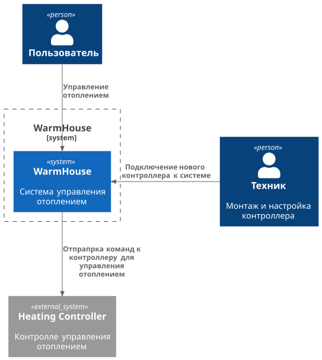

**TO-BE**

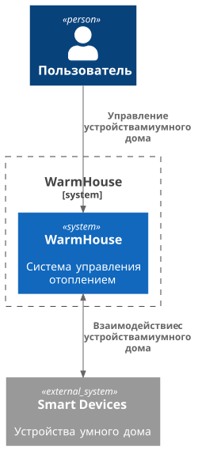

# Задание 2. Проектирование микросервисной архитектуры

В этом задании вам нужно предоставить только диаграммы в модели C4. Мы не просим вас отдельно описывать получившиеся микросервисы и то, как вы определили взаимодействия между компонентами To-Be системы. Если вы правильно подготовите диаграммы C4, они и так это покажут.

### 2. Целевая экосистема, которую необходимо создать

**Диаграмма контейнеров (Containers)**

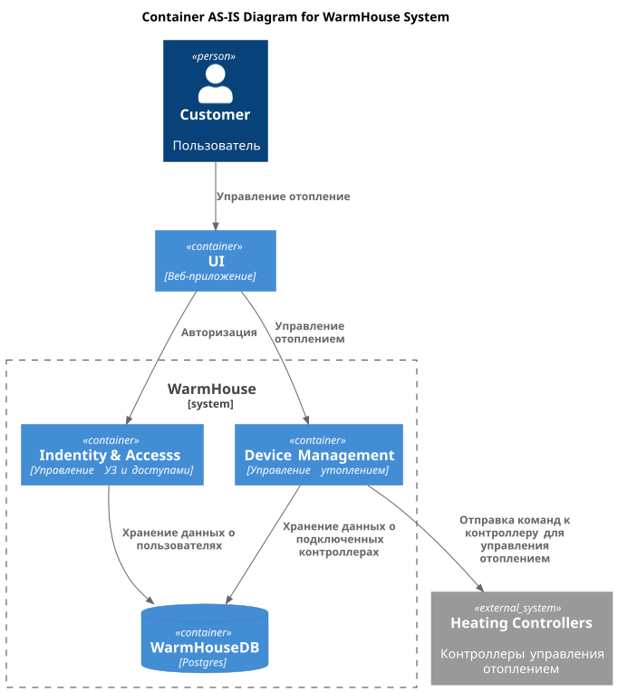

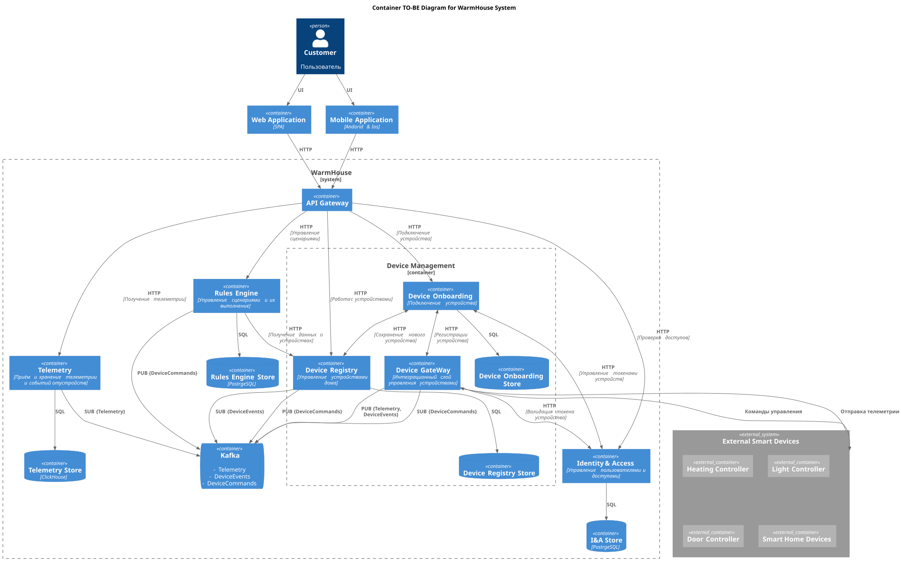

**Диаграмма компонентов (Components)**

**API Gateway** -  единая точка входа для Web/Mobile: маршрутизирует запросы в нужные backend-сервисы и выполняет базовые проверки безопасности (валидация токена/сессии, первичная авторизация)
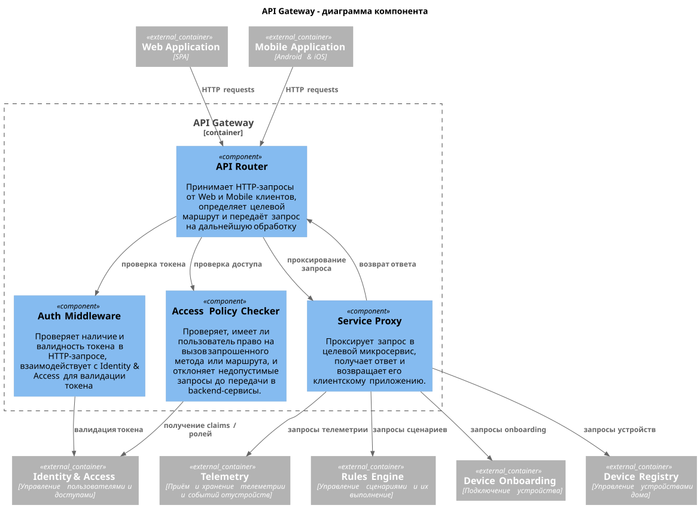


**Identity & Access** - регистрация/вход, управление сессиями и токенами, ролевая модель доступа и авторизация действий.
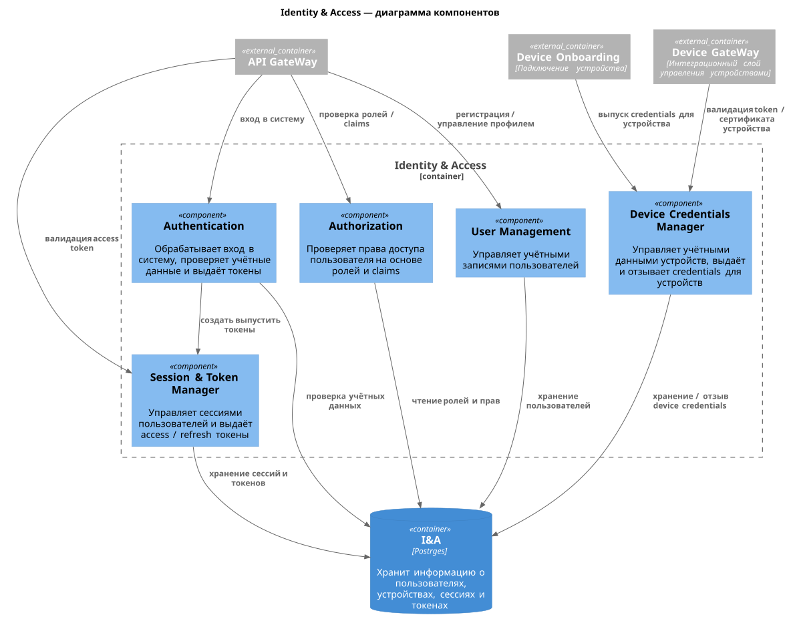

**Device Registry** — реестр устройств дома: метаданные устройства (имя, комната, тип),статус доступности (online/offline/last seen), группировка/теги.
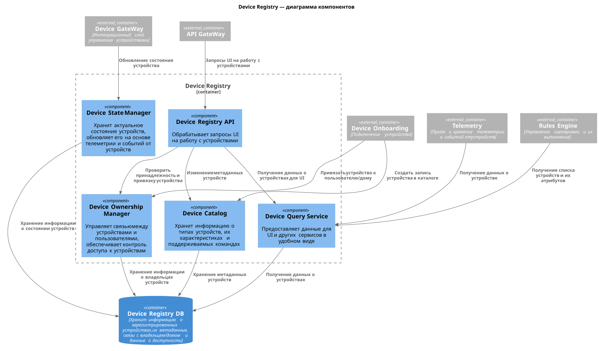

**Device Onboarding** — подключение устройств: подтверждение владения, выдача учётных данных устройству (ключи/токены),перенос/сброс.
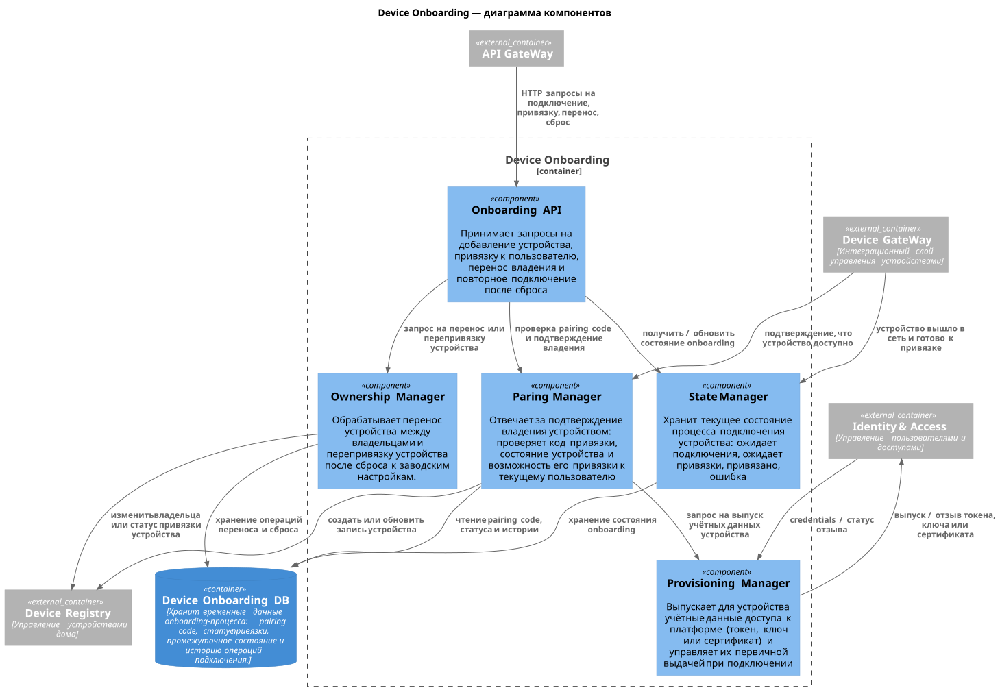

**Device Gateway** — интеграционный слой для устройств:поддержка протоколов/каналов, управление соединениями, нормализация команд и событий в единый внутренний формат.
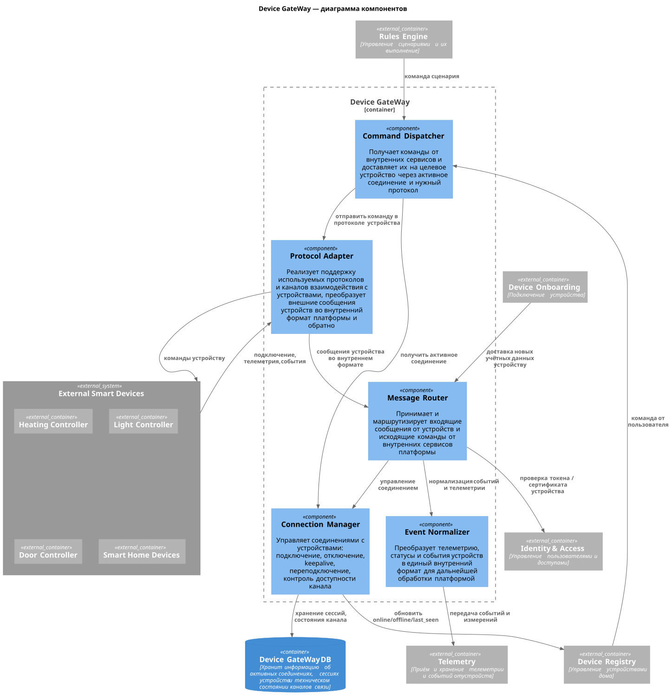

**Telemetry** -  приём и хранение телеметрии и событий от устройств (измерения, состояния, события камер/ворот), предоставление “последних значений” и истории (time-series) для UI и сценариев.
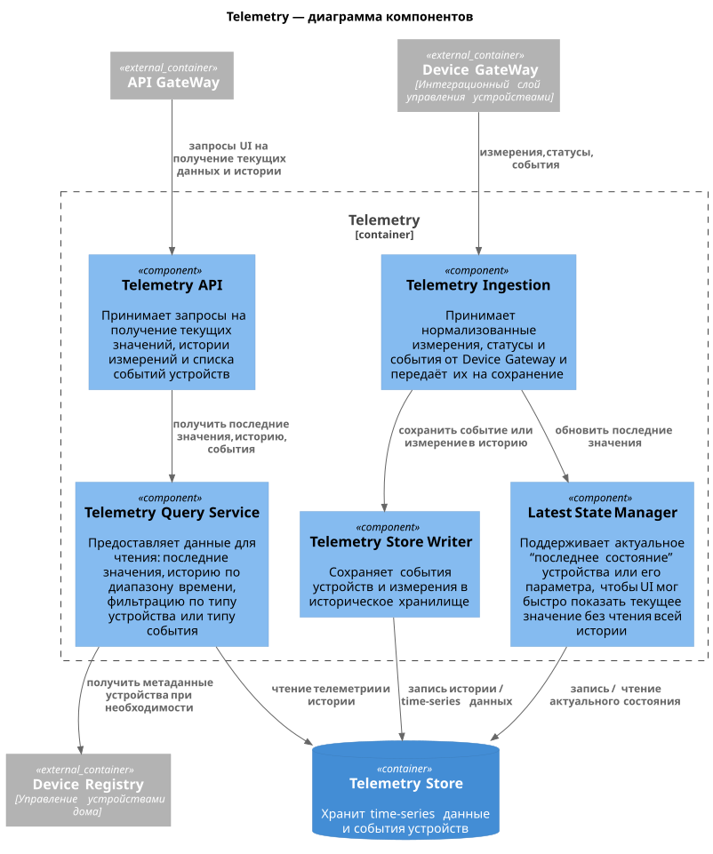

**Rules Engine** — управление сценариями и их выполнение: конструктор правил (триггеры/условия/действия, версии, тест) и исполнитель (планирование, дедупликация, ретраи, журнал выполнения).
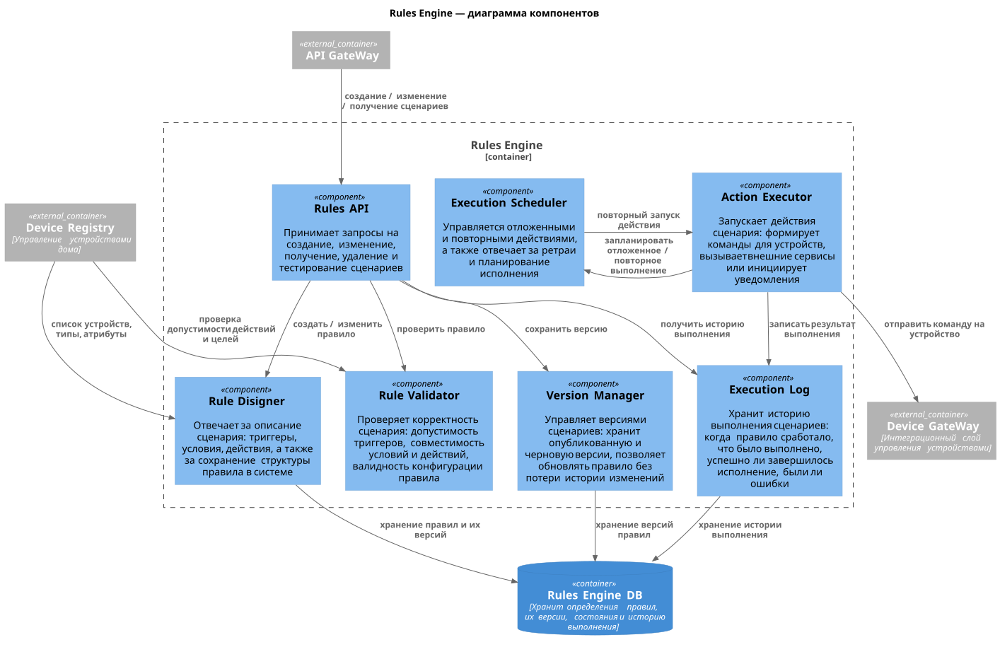

**Диаграмма кода (Code)**

Добавьте одну диаграмму или несколько.

# Задание 3. Разработка ER-диаграммы

Добавьте сюда ER-диаграмму. Она должна отражать ключевые сущности системы, их атрибуты и тип связей между ними.

# Задание 4. Создание и документирование API

### 1. Тип API

Укажите, какой тип API вы будете использовать для взаимодействия микросервисов. Объясните своё решение.

### 2. Документация API

Здесь приложите ссылки на документацию API для микросервисов, которые вы спроектировали в первой части проектной работы. Для документирования используйте Swagger/OpenAPI или AsyncAPI.

# Задание 5. Работа с docker и docker-compose

Перейдите в apps.

Там находится приложение-монолит для работы с датчиками температуры. В README.md описано как запустить решение.

Вам нужно:

1) сделать простое приложение temperature-api на любом удобном для вас языке программирования, которое при запросе /temperature?location= будет отдавать рандомное значение температуры.

Locations - название комнаты, sensorId - идентификатор названия комнаты

```
	// If no location is provided, use a default based on sensor ID
	if location == "" {
		switch sensorID {
		case "1":
			location = "Living Room"
		case "2":
			location = "Bedroom"
		case "3":
			location = "Kitchen"
		default:
			location = "Unknown"
		}
	}

	// If no sensor ID is provided, generate one based on location
	if sensorID == "" {
		switch location {
		case "Living Room":
			sensorID = "1"
		case "Bedroom":
			sensorID = "2"
		case "Kitchen":
			sensorID = "3"
		default:
			sensorID = "0"
		}
	}
```

2) Приложение следует упаковать в Docker и добавить в docker-compose. Порт по умолчанию должен быть 8081

3) Кроме того для smart_home приложения требуется база данных - добавьте в docker-compose файл настройки для запуска postgres с указанием скрипта инициализации ./smart_home/init.sql

Для проверки можно использовать Postman коллекцию smarthome-api.postman_collection.json и вызвать:

- Create Sensor
- Get All Sensors

Должно при каждом вызове отображаться разное значение температуры

Ревьюер будет проверять точно так же.
